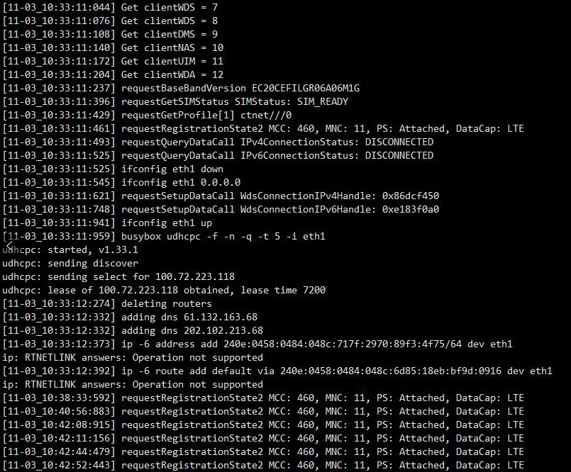

#IPv6

- ipv6 地址怎么加默认路由
- ipv6 地址组成
- ECM 获取ipv6地址

## 默认路由

	
	
	ip -6 address add x:x:x::x/64 dev eth1
	
	ip -6 address add default via x:x:x::x dev eth1

和IPv4 的指令差不多

	
	ip -4 address flush dev wwan0
	ip -4 address add 10.x.x.x/28 dev wwan0
	ip -4 route add default via 10.x.x.Y dev wwan0
		
	# route del -A inet6 default gw XXXX:YYYY::ZZZ dev ethX
	# ip -6 route del ::/0 via XXXX:YYYY::ZZZdev ethX
	# route add -A inet6 default gw XXXX:YYYY::ZZZ dev ethX metric 2000
	# ip -6 route add ::/0 via XXXX:YYYY::ZZZdev ethX metric 2000
	# ip -6 r show | grep default
	default via XXXX:YYYY::ZZZ dev ethX metric 2000
	
	route -A inet6 add  IPv6地址/64 gw 网关  #永久IPv6静态路由

	
## ipv6 地址组成

##

