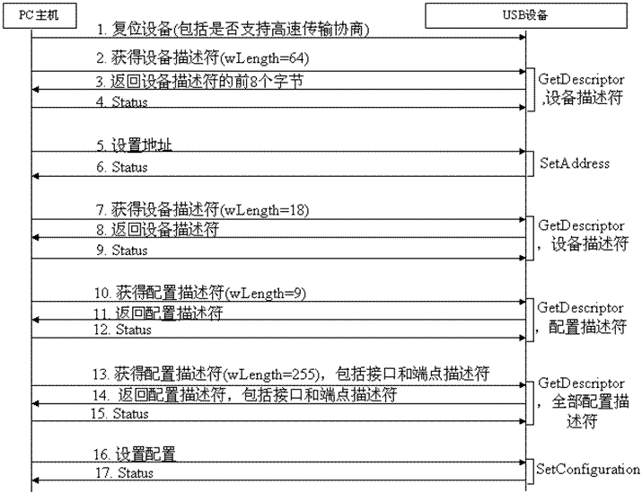

#枚举遇到的问题

USB 枚举识别过程

在Quectel的文档里只提过
	
	urb->transfer_flags |= URB_ZERO_PACKET;
	
而关于这个URB_ZERO_PACKET的描述

https://blog.csdn.net/flydream0/article/details/70215667

在进行USB CDC类开发时，无法从设备端向主机端发送64整数倍数据，最本质的原因就是，当发送数据长度恰好是Data In端点的最大包长整数倍时，最后一包数据必须是零长度的数据包(ZLP)。这是由于在USB标准中，接收端并不是通过已经接收的数据长度来判断是否接收完成，且发送端也并没有给出将要发送多长的数据，因此，接收端在接收数据前，并不知道将要接收的数据是多少，那么，问题就来了，接收端又是如何判断当前的数据已经全部接收了呢？有两点：

若接收到的数据包长不足最大包长时，则认为当前传输完成
如接收到的数据包长为零时，则认为当前传输完成。
正式由于上述两种判断，当传输的数据刚好是端点的最大包长时，当发送完最后一包(比如64个字节)时，接收端无法判断是否传输结束，进而继续等待下一包数据。这个就是问题本质所在。

对应的Solution: 

在发送完最后一包数据后，判断发送的包长是否为端点最大包长的整数倍，如是，则补发一个零长度的数据包(ZLP)。

## 识别不到

### 类型一 

反映开机过程，USB设备和主控同时开机，模块不能识别，但是等开机后，重新reset usb设备，usb设备可以被识别到。
	
	
	usb 1-1: new full speed USB device usings3c2410-ohci and address 2
	usb 1-1: device descriptor read/64, error -62
	usb 1-1: device descriptor read/64, error -62
	usb 1-1: new full speed USB device using s3c2410-ohci andaddress 3
	usb 1-1: device descriptor read/64, error -62
	usb 1-1: device descriptor read/64, error -62
	usb 1-1: new full speed USB device using s3c2410-ohci andaddress 4
	usb 1-1: device not accepting address 4, error -62
	usb 1-1: new full speed USB device using s3c2410-ohci andaddress 5
	usb 1-1: device not accepting address 5, error -62
	hub 1-0:1.0: unable to enumerate USB device on port 1
	————————————————

这种情况，根据网上的经验，主控在开机过程中，识别到了USb设备，但是主控的USB时钟没有打开导致。 https://www.cnblogs.com/dakewei/p/5927556.html

有人说 modeprobe -r ehci_hcd 卸载驱动重装...

### 类型二

